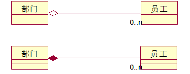

1.聚合与组合

（1）聚合与组合都是一种结合关系，只是额外具有整体-部分的意涵。

（2）部件的生命周期不同

聚合关系中，整件不会拥有部件的生命周期，所以整件删除时，部件不会被删除。再者，多个整件可以共享同一个部件。
组合关系中，整件拥有部件的生命周期，所以整件删除时，部件一定会跟着删除。而且，多个整件不可以同时间共享同一个部件。

（3）聚合关系是“has-a”关系，组合关系是“contains-a”关系。

“弱”包含表示如果部门没有了，员工也可以继续存在；
“强”包含表示如果部门没有了，员工也不再存在；
在做软件需求时，往往会将所有的包含关系画成“弱”包含，后面发现某些关系可以表示为“强”包含是，才转为实心菱形。

2.关联和聚合

（1）表现在代码层面，和关联关系是一致的，只能从语义级别来区分。

（2）关联和聚合的区别主要在语义上，关联的两个对象之间一般是平等的，例如你是我的朋友，聚合则一般不是平等的。

（3）关联是一种结构化的关系，指一种对象和另一种对象有联系。

（4）关联和聚合是视问题域而定的，例如在关心汽车的领域里，轮胎是一定要组合在汽车类中的，因为它离开了汽车就没有意义了。但是在卖轮胎的店铺业务里，就算轮胎离开了汽车，它也是有意义的，这就可以用聚合了。

3.关联和依赖

（1）关联关系中，体现的是两个类、或者类与接口之间语义级别的一种强依赖关系，比如我和我的朋友；这种关系比依赖更强、不存在依赖关系的偶然性、关系也不是临时性的，一般是长期性的，而且双方的关系一般是平等的。

（2）依赖关系中，可以简单的理解，就是一个类A使用到了另一个类B，而这种使用关系是具有偶然性的、临时性的、非常弱的，但是B类的变化会影响到A。

4.泛化和实现

实现表示类对接口的实现关系，表示方式：用一条带有空心三角箭头的虚线指向接口。

泛化表示类与类之间的继承关系、接口与接口之间的继承关系，表示方式一条带有空心三角箭头的实线指向基类（父接口）。

5.综合比较

　　这几种关系都是语义级别的，所以从代码层面并不能完全区分各种关系；但总的来说，后几种关系所表现的强弱程度依次为：

    <b>泛化 = 实现 > 组合 > 聚合 > 关联 > 依赖<b>

　　其中依赖（Dependency）的关系最弱，而关联（Association），聚合（Aggregation），组合（Composition）表示的关系依次增强。换言之关联，聚合，组合都是依赖关系的一种，聚合是表明对象之间的整体与部分关系的关联，而组合是表明整体与部分之间有相同生命周期关系的聚合。

而关联与依赖的关系用一句话概括下来就是，依赖描述了对象之间的调用关系，而关联描述了对象之间的结构关系。